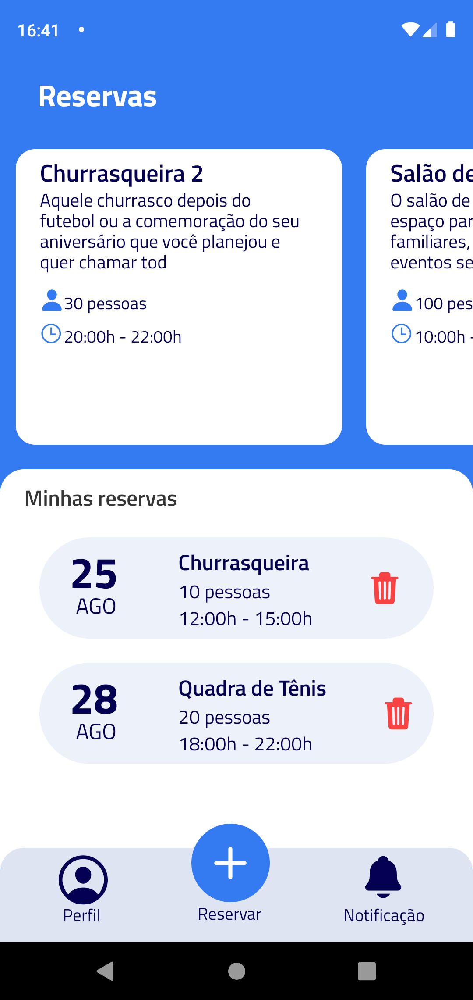
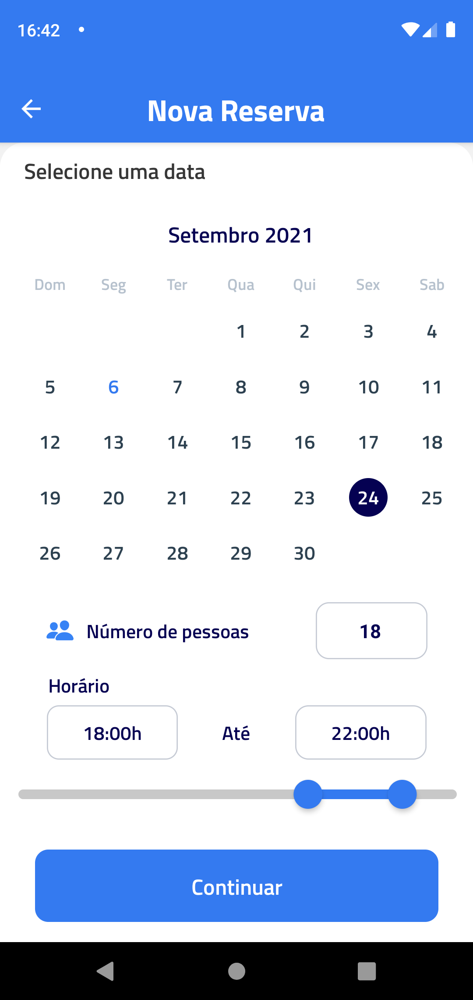
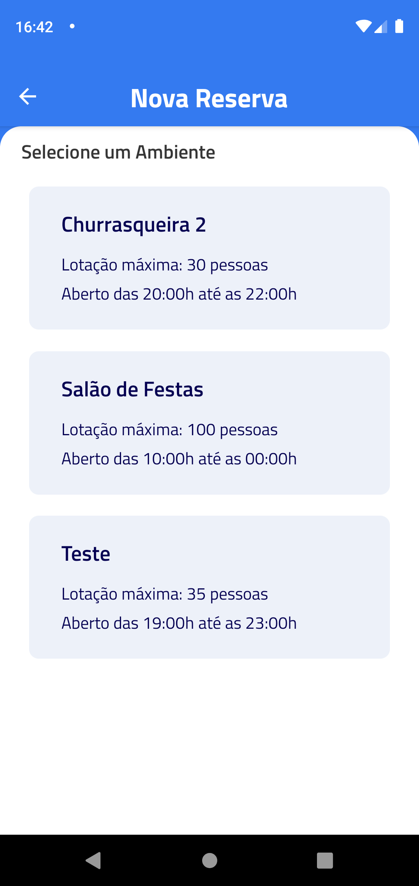
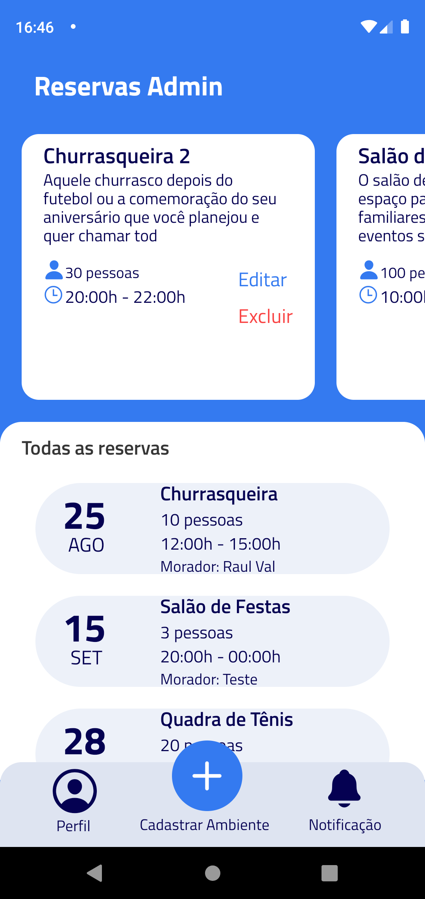
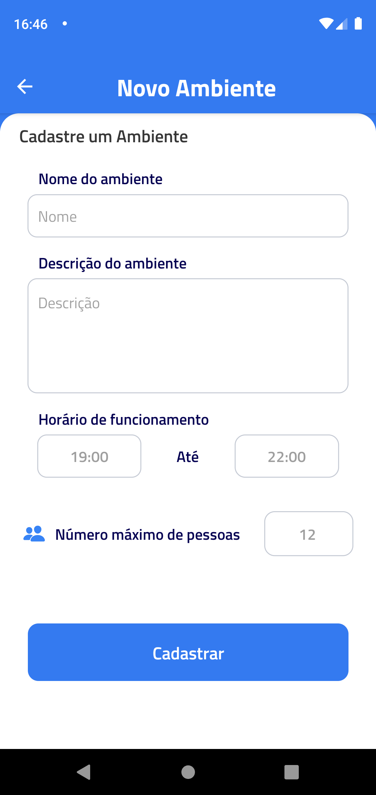

## 🚀 Screenshots

<h1 align="center">
    
    
    
    
    
    
</h1>

## 💻 Project

Reservapp é um aplicativo criado como projeto final para a disciplina de Programação de Dispositivos Móveis da UTFPR

## 🧪 Technologies

O projeto foi desenvolvido usando as seguintes tecnologias:

- [React Native](https://reactnative.dev/)
- [Firebase](https://firebase.google.com/)
- [Expo](https://expo.dev/)

## 📝 License

This project is licensed under the MIT License. See the [LICENSE](LICENSE) file for details.
